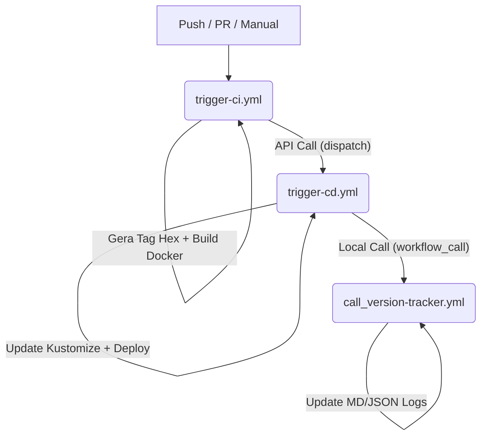

<!-- ./.github/workflows/README/.md -->

# 🛠️ Dicionário de Workflows - FBSO

Este diretório contém os fluxos de automação de Integração Contínua (CI) e Entrega Contínua (CD). A arquitetura é baseada em eventos e chamadas encadeadas.

## 🧭 Mapa de Fluxo (Call Graph)

---

## 📖 Glossário de Workflows

### 1. `trigger-ci.yml` (Continuous Integration)

* **Responsabilidade:** Compilar o código, rodar testes, gerar a imagem Docker e enviá-la para o Docker Hub.
* **Gatilhos:** `push`, `pull_request` ou manual via `workflow_dispatch`.
* **Saída Principal:** Uma tag de imagem única no formato `HexData-vRunNumber`.
* **Próximo Passo:** Dispara o `trigger-cd.yml` via API enviando os metadados da build.

### 2. `trigger-cd.yml` (Continuous Deployment)

* **Responsabilidade:** Receber a tag de imagem, identificar o ambiente (Dev, Staging, Prod) via branch, atualizar o `kustomization.yaml` e aplicar no Kubernetes.
* **Gatilhos:** Chamado externamente pelo CI.
* **Segurança:** Utiliza `environment` do GitHub para controle de aprovações.
* **Próximo Passo:** Invoca o `call_version-tracker.yml` para documentar o sucesso do deploy.

### 3. `call_version-tracker.yml` (Observability Specialist)

* **Responsabilidade:** Manter a "Fonte da Verdade" sobre quais versões estão em quais ambientes.
* **Tipo:** Reusable Workflow (`workflow_call`).
* **Arquivos Gerados/Atualizados:**
* `HISTORY.md`: Log cronológico de todas as movimentações.
* `INVENTORY.md`: Tabela Markdown com o estado atual de cada serviço.
* `inventory.json`: Base de dados estruturada para consumo de sistemas externos.

---

## 🛠️ Manutenção

Ao adicionar um novo workflow, certifique-se de:

1. Atualizar o gráfico Mermaid acima.
2. Indicar se o workflow é um gatilho primário (Trigger) ou uma função auxiliar (Call).
3. Utilizar o padrão `[skip ci]` em commits gerados automaticamente para evitar recursão.

---

### Dica de Wit (O toque de Gemini):

Tratar sua pasta de infra como um produto documentado é o que diferencia um "SysAdmin cansado" de um "Arquiteto de Cloud". Esse README é o "Waze" da sua esteira de deploy.
